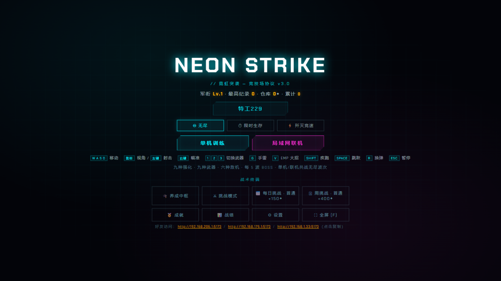

<div align="center">

# NEON STRIKE · 霓虹突袭

**霓虹赛博竞技场 —— 无尽波次生存 Roguelite FPS**



一款纯 TypeScript + Three.js 的网页第一人称射击游戏：霓虹竞技场里对抗永无穷尽的无人机、重装、精英与 BOSS。**六层程序化随机**让每局都不同，**永久养成系统**让你玩不停手。单机零依赖，联机只需同一局域网。

---

## ✨ 特色一览

- 🌊 **无尽波次**：6 种敌机、每 5 波一个三阶段 BOSS
- 🎲 **六层随机**：地图 · 敌机词缀 · 武器 · 武器词缀 · 波内事件 · 每日词条
- 🛠 **Roguelite Build**：波间三选一强化，白→蓝→紫→金稀有度
- ⚖️ **诅咒交易**：高风险的红色交易强化（拿血换伤害）
- 🔫 **九种武器**：步枪/冲锋/霰弹/磁轨/榴弹/等离子光束/连锁电弧/追踪导弹/火焰喷射器
- ✨ **武器词缀**：炽热/虹吸/迅捷/扩容/致命，同一把枪不同词缀 = 不同武器
- 💀 **精英词缀**：彩色光圈预警——迅捷/坚壁/爆破/虹吸/分裂
- ⏱ **三种模式**：无尽 · 限时生存(5分钟) · 歼灭竞速
- 📅 **每日挑战**：固定种子+双词条，每天一套，本地最佳纪录
- 👥 **局域网联机**：房间码制——合作生存 & PvP 大乱斗
- 🏅 **永久成长**：军衔/经验 · 军械库永久强化 · 战绩统计 · 成就
- 📜 **合同任务**：每局随机目标，逼你换打法

---

## 🖥 本地运行

```bash
npm install
npm run dev
```
浏览器打开 **http://localhost:5173** 即可游玩。

- `npm run dev` 会自动连带启动局域网联机服务（端口 3001）
- 生产构建：`npm run build`；单独跑联机服务：`npm run server`

### 局域网联机
1. `npm run dev`
2. 主菜单底部会显示你的局域网地址（**点击即可复制**），如 `http://192.168.1.33:5173`
3. 同网络的朋友打开该地址，创建/输入 4 位房间码加入
4. 首次请**在防火墙放行 Node.js**（端口 5173 与 3001）

---

## 🎮 操作

```
WASD 移动 · 鼠标 视角/左键射击 · 右键 瞄准
1-9 / Q 切换武器 · R 换弹 · G 手雷 · C 冲刺
Shift 疾跑 · Space 跳跃 · F 全屏 · Esc 暂停
```

---

## 🏗 技术栈

- **TypeScript**（严格模式）— 全部游戏逻辑
- **[Three.js](https://threejs.org/)** — WebGL 渲染 + UnrealBloom 后期
- **[Vite](https://vitejs.dev/)** — 开发/构建（并提供局域网分享接口）
- **[ws](https://github.com/websockets/ws)** — 局域网 WebSocket 联机服务
- **Web Audio API** — 程序化合成音效，零音频素材

### 目录结构
```
neon-strike/
├── index.html          # 界面骨架（主菜单/HUD/商店/房间/结算）
├── vite.config.ts      # 构建 + 局域网分享接口
├── src/
│   ├── main.ts         # 核心：渲染/射击/波次/商店/词缀/每日/碰撞
│   ├── enemies.ts      # 6 种敌机建模 + 精英词缀
│   ├── net.ts          # WebSocket 客户端
│   ├── audio.ts        # 程序化合声音效
│   ├── particles.ts    # GPU 粒子池
│   └── ui.ts           # 伤害飘字/小地图/名牌
└── server/
    └── index.mjs       # 局域网联机服务（房间制合作 & PvP）
```

---

## 🧠 设计思路

耐玩性的核心是**六层互不重叠的随机**，每层改变游戏的一个维度，让两局几乎不可能重样：

1. **强化** —— 每局的数值曲线（稀有度卡片）
2. **敌人** —— 每波威胁构成 + 精英词缀
3. **武器** —— 你能拿到哪些机制
4. **武器词缀** —— 每把枪的个体身份
5. **波内事件** —— 波中段的节奏突变（空袭/增援/狂暴）
6. **地图** —— 空间布局与主题

设计参考：Risk of Rain 2 精英词缀、Slay the Spire 每日挑战、CS 式武器经济。

---

## 📜 许可证

**Creative Commons Attribution-NonCommercial 4.0 International (CC BY-NC 4.0)**

本作品采用知识共享署名-非商业性使用 4.0 国际许可协议。**禁止商用**，允许学习、修改与免费分享，转载须保留署名。

- 完整协议：https://creativecommons.org/licenses/by-nc/4.0/legalcode
- 中文全文：https://creativecommons.org/licenses/by-nc/4.0/legalcode.zh-Hans

---

*纯 TypeScript 从零构建 —— 无游戏引擎、无素材包、全部程序化生成。*